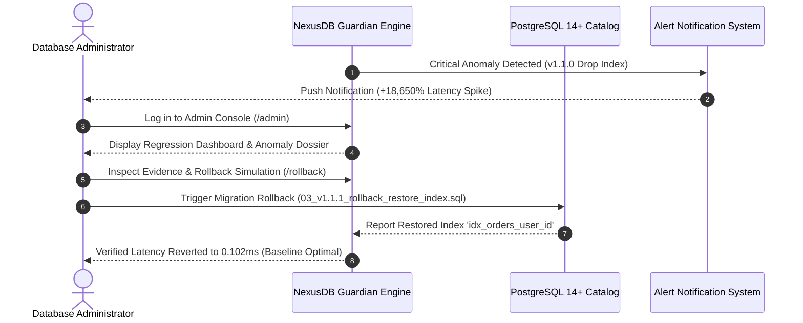
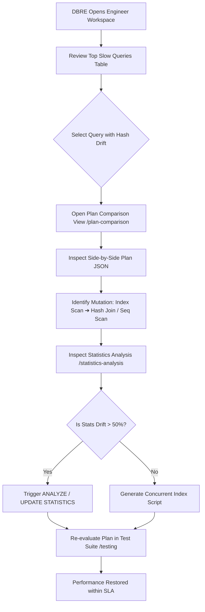
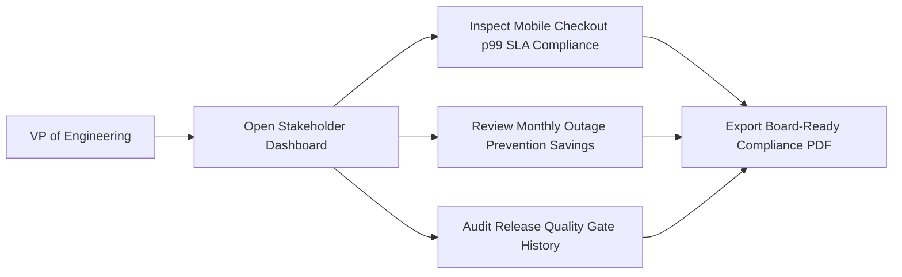
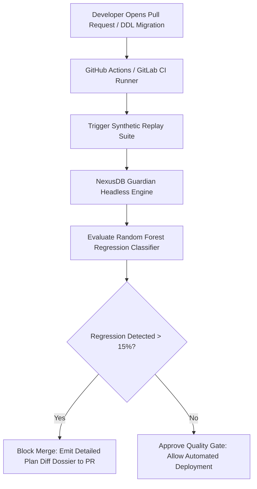
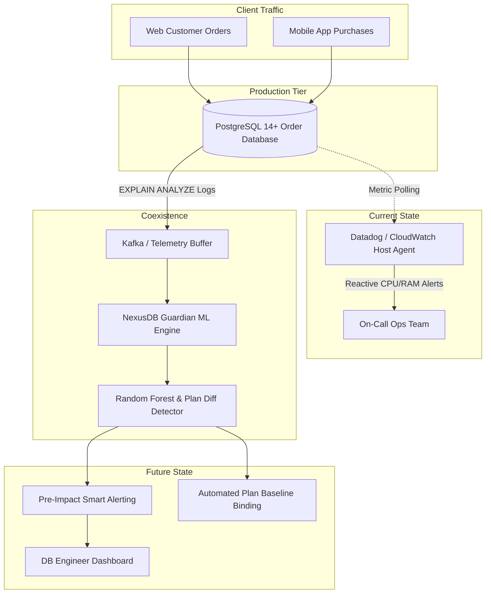

# User & Workflow Map: NexusDB Guardian

## 1. Executive Summary
This document delineates the persona workflows, operational journeys, automated detection pipelines, and legacy coexistence architecture for **NexusDB Guardian (SQL Query Regression Detector)** serving high-volume transactional order databases for web and mobile customers.

---

## 2. Multi-Persona User Journeys

### 2.1 Database Administrator (DBA) Journey: Incident Triage & Emergency Rollback

### 2.2 Database Reliability Engineer (DBRE) Journey: Plan Diffing & Stale Statistics Tuning

### 2.3 Executive & VP of Engineering Journey: Financial & SLA Impact Governance

---

## 3. Automated Pre-Deployment CI/CD Pipeline Integration

---

## 4. Legacy APM Coexistence & Migration Architecture

